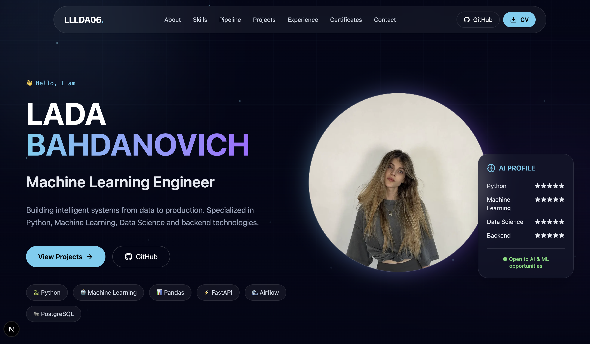

# 🚀 Lada Bahdanovich — AI Developer Portfolio

  

  
  

<h3 align="center">
  Modern AI-inspired portfolio website built with Next.js,
  showcasing Machine Learning, Data Science and Backend projects.
</h3>

🤖 Artificial Intelligence
⚡ Interactive Animations
💻 Modern Web Technologies
📱 Fully Responsive Design

---

## 🎬 Website Preview

  

A dynamic portfolio experience featuring:

* smooth animations
* AI-inspired visual design
* interactive project cards
* responsive layouts
* modern developer experience

---

## 🛠 Built With

### Main Technologies

* ⚛️ Next.js
* 🔷 TypeScript
* 🎨 Tailwind CSS
* 🎞 Framer Motion
* 🌊 Lenis Smooth Scroll
* 🎯 React Type Animation
* 🎨 Lucide Icons

---

## 🌐 Live Website

Visit the deployed portfolio:

🔗 https://your-vercel-url.vercel.app

---

## 📸 Screenshots

### Hero Section

### Projects Section

---

## 📈 Project Goals

The main goals of this portfolio:

✅ Present Machine Learning projects professionally
✅ Showcase backend development experience
✅ Create a modern developer identity
✅ Experiment with animations and interactive UI
✅ Build a foundation for future AI-powered features

---

## 🗺 Future Improvements

* 🤖 AI chatbot assistant
* 📊 Interactive ML model demonstrations
* 📈 Live GitHub statistics
* 🧠 AI-powered project recommendations
* 🌌 More advanced animations

---

## 👩‍💻 Author

### Lada Bahdanovich

Machine Learning Engineer in progress.

Interested in:

* Artificial Intelligence
* Machine Learning
* Data Science
* Backend Development
* Building intelligent systems

⭐ If you like this project, feel free to star the repository!
